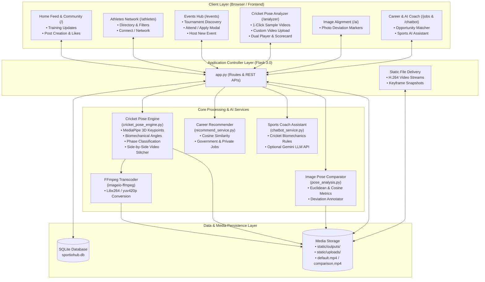
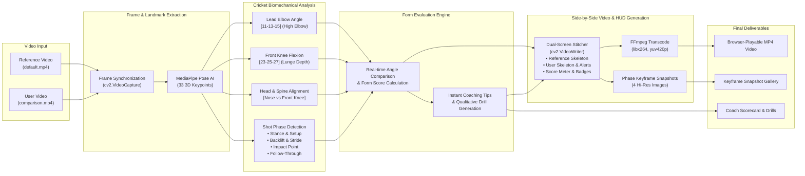
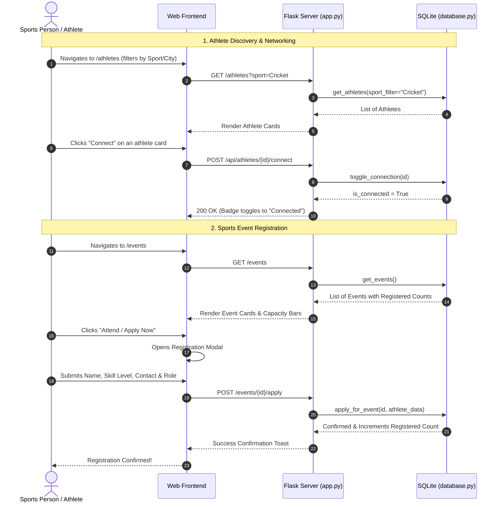
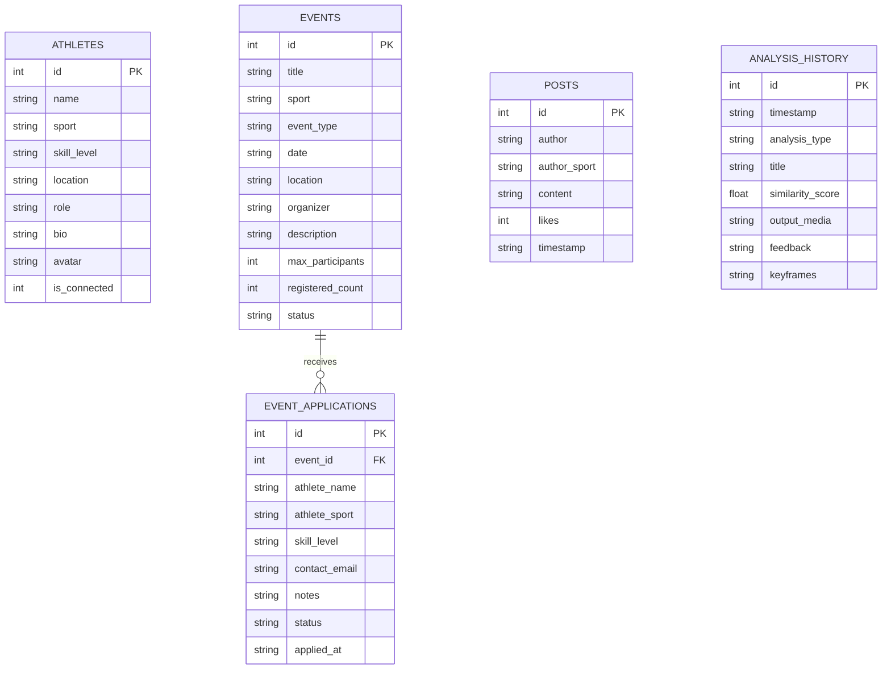

# SportioHub Architecture Diagram

This document illustrates the complete architectural design of **SportioHub**, covering the front-end user experience, the Flask application backend, the AI/computer-vision pose analysis engine, and data persistence.

---

## 1. System Architecture Overview

---

## 2. Cricket Pose Analyzer Video Pipeline

The video analysis pipeline takes either pre-loaded sample videos (`default.mp4` vs `comparison.mp4`) or custom athlete footage, processes every frame through MediaPipe Pose, evaluates cricket batting technique, and produces web-compatible side-by-side videos.

---

## 3. Athlete Networking & Events Workflow

---

## 4. Database Entity-Relationship (ER) Diagram

---

## 5. Technology Stack Summary

| Layer              | Technologies                                              | Purpose                                                                          |
| ------------------ | --------------------------------------------------------- | -------------------------------------------------------------------------------- |
| **Frontend**       | HTML5, Tailwind CSS, FontAwesome, JavaScript (Fetch/AJAX) | Responsive sports dark UI, video controls, modals, and real-time DOM updates     |
| **Backend**        | Python 3.12, Flask 3.0, Werkzeug                          | REST APIs, route controllers, static file serving, application management        |
| **Pose Analysis**  | Google MediaPipe Pose (`mediapipe`), OpenCV (`cv2`)       | 33 3D landmark extraction, biomechanical angle computation, skeleton rendering   |
| **Video Engine**   | `imageio-ffmpeg` (libx264, yuv420p)                       | Side-by-side stitcher and transcode to universally browser-compatible MP4        |
| **Recommendation** | Scikit-Learn (`cosine_similarity`), NumPy, Pandas         | Career and sports opportunities profile matching                                 |
| **Database**       | SQLite (`sportiohub.db`) with MongoDB Atlas fallback      | Persistent storage of athletes, events, applications, feed posts, and scorecards |
